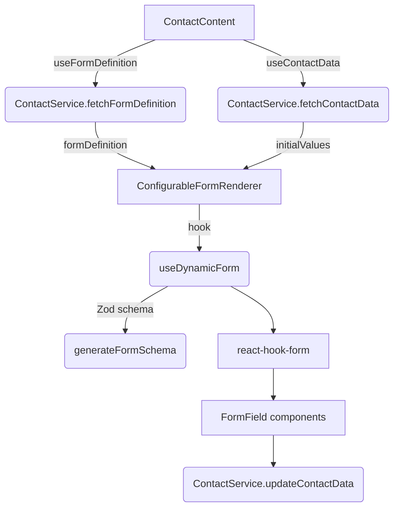

# Dynamic Contact Form – Architecture & Logic

This document dives into how the **dynamic contact form** is delivered to the browser, rendered, validated and persisted.

---

## 1. High-level idea

- The contact form is **described entirely in JSON** (groups, fields, validations, visibility rules).
  This definition lives on the server and can be changed without redeploying the UI.
- At runtime the client fetches **(1)** the _form definition_ and **(2)** the _contact data_.
  Both are combined and fed into a single renderer component.
- **React Hook Form** powers state management, while **Zod** provides type-safe validation generated from the JSON rules.

> Result: product managers can reorder fields or tweak validation by editing JSON and pressing save.

---

## 2. Data flow



Legend: solid arrows = data in, dotted arrows = async save.

---

## 3. Key building blocks

| Piece                       | File                                                        | Responsibility                                   |
| --------------------------- | ----------------------------------------------------------- | ------------------------------------------------ |
| **Form definition fetch**   | `src/features/contact/api/ContactService.ts`                | REST call to `/forms/definition/:id`             |
| **Contact data fetch/save** | same service                                                | CRUD under `/forms/contact/:id`                  |
| **Definition hook**         | `src/features/contact/hooks/useFormDefinition.ts`           | caches & refetches schema                        |
| **Data hook**               | `src/features/contact/hooks/useContactData.ts`              | loads existing contact, exposes `saveFormValues` |
| **Schema generator**        | `src/utils/zodSchemaGenerator.ts`                           | turns JSON rules into Zod schema                 |
| **State/logic hook**        | `src/hooks/useDynamicForm.ts`                               | wraps React Hook Form + editing workflow         |
| **Renderer**                | `src/components/dynamic-forms/ConfigurableFormRenderer.tsx` | groups + fields                                  |
| **Field**                   | `src/components/dynamic-forms/FormField.tsx`                | individual input + RHF `Controller`              |
| **Group**                   | `src/components/dynamic-forms/FieldGroup.tsx`               | collapsible group accordion                      |

---

## 4. Fetching the definition & data

```34:46:src/features/contact/hooks/useFormDefinition.ts
export function useFormDefinition(formId = 'contactForm') { … }
```

- Caches the last requested `formId` to avoid duplicate calls.
- Exposes `loading`, `error`, `refetch` for resiliency.

```51:80:src/features/contact/hooks/useContactData.ts
const fetchContactData = async (targetContactId = contactId) => { … }
```

- Strips metadata (`id`, `created_at`, `updated_at`) before exposing as `formValues`.

---

## 5. Rendering & state management

`ConfigurableFormRenderer` orchestrates everything:

```38:56:src/components/dynamic-forms/ConfigurableFormRenderer.tsx
const { form, isEditing, … } = useDynamicForm({
  formDefinition,
  initialValues: values,
  onValuesChange,
});
```

- Provides **Edit / Save / Cancel** toolbar.
- Delegates to `FieldGroup` / `FormField` for visual layout.

### useDynamicForm highlights

_Initialisation_

```81:98:src/hooks/useDynamicForm.ts
const form = useForm({
  resolver: zodResolver(zodSchema),
  defaultValues: initialValues,
  mode: 'onChange',
});
```

_Editing workflow_

```226:244:src/hooks/useDynamicForm.ts
startEdit() { … }  // stores original values
saveEdit()  { … }  // RHF `trigger()` + API save
cancelEdit() { … } // resets to original
```

_Visibility rules_ – a field may depend on another field’s value:

```194:203:src/hooks/useDynamicForm.ts
const dependsOnValue = getValues(dependencyFieldId);
return isFieldVisible(field, dependsOnValue);
```

_Performance metrics_ – render/validation times captured via `performance.now()` for dev mode.

---

## 6. Validation pipeline

1. Each **FieldDefinition** optionally contains `validation` rules (legacy object _or_ new array format).
2. `generateFormSchema` converts those rules into a **Zod** object schema.
3. `react-hook-form` uses `zodResolver` to validate on change / blur / submit.

Example rule → Zod transformation:

```97:105:src/utils/zodSchemaGenerator.ts
case 'max':
  if (result instanceof z.ZodNumber) {
    result = result.max(rule.value, rule.errorMessage);
  }
```

Cross-field validation (“match”) is added at the form level:

```308:325:src/utils/zodSchemaGenerator.ts
schema = schema.refine(data => data[pwd] === data[confirm], {
  message: 'Passwords do not match',
  path: [confirm],
});
```

---

## 7. Persisting changes

`ContactContent` wires `onValuesChange` to `saveFormValues`:

```24:32:src/features/contact/components/ContactContent.tsx
const handleValuesChange = async (newValues) => {
  setFormValues(newValues);
  await saveFormValues(newValues); // PUT /forms/contact/:id
};
```

The save call is **debounced by developer discretion** (currently immediate, can be wrapped with `utils/debounce.ts`).

---

## 8. Field rendering matrix

| Field type                                   | React component                    | Notes                       |
| -------------------------------------------- | ---------------------------------- | --------------------------- |
| `text`, `email`, `tel`, `password`, `number` | `Input` (`<input>` under the hood) | Uses `getInputType` utility |
| `textarea`                                   | `Textarea`                         | supports `rows` UI hint     |
| `dropdown`                                   | `Select` + `SelectItem[]`          | options from JSON           |
| `radio`                                      | `RadioGroup` + `RadioGroupItem`    |
| `checkbox`                                   | `Checkbox`                         |
| `date`                                       | `DatePicker`                       |

---

## 9. Form Definition JSON Structure

The form definition is a JSON object that describes the entire structure and behavior of the form. Here's a comprehensive example of a user registration form that demonstrates the key features:

```json
{
  "formDefinition": {
    "schemaVersion": 1,
    "title": "User Registration Wizard",
    "description": "Production-grade example demonstrating advanced features for dynamic form rendering.",
    "groups": [
      {
        "id": "personal_info",
        "label": "Personal Information",
        "fields": [
          {
            "id": "first_name",
            "label": "First Name",
            "type": "text",
            "placeholder": "John",
            "validation": [
              {
                "type": "required",
                "errorMessage": "First name is required"
              },
              {
                "type": "minLength",
                "value": 2,
                "errorMessage": "First name must be at least 2 characters"
              },
              {
                "type": "maxLength",
                "value": 50,
                "errorMessage": "First name cannot exceed 50 characters"
              }
            ]
          }
          // ... other personal info fields
        ]
      },
      {
        "id": "contact_info",
        "label": "Contact Information",
        "fields": [
          // ... contact info fields
        ]
      }
    ]
  }
}
```

### Key Concepts

1. **Form Structure**
   - `schemaVersion`: Version control for backward compatibility
   - `title` & `description`: Form metadata
   - `groups`: Array of field groups for logical organization

2. **Field Groups**
   - `id`: Unique identifier for the group
   - `label`: Display name
   - `fields`: Array of form fields

3. **Field Types**
   - `text`: Basic text input
   - `textarea`: Multi-line text
   - `email`: Email validation
   - `tel`: Phone numbers
   - `date`: Date picker
   - `dropdown`: Select from options
   - `radio`: Radio button group
   - See [Field rendering matrix](#8-field-rendering-matrix) for complete list

4. **Validation Rules**

   ```json
   "validation": [
       {
           "type": "required | minLength | maxLength | pattern | email | ...",
           "value": "optional value for the rule",
           "errorMessage": "User-friendly error message"
       }
   ]
   ```

5. **Visibility Rules**

   ```json
   "visibility": {
       "dependsOn": "other_field_id",
       "value": "specific value" | "valueNotEmpty": true
   }
   ```

6. **UI Customization**
   ```json
   "ui": {
       "colSpan": "lg:col-span-2",
       "rows": 4  // for textarea
   }
   ```

### Usage Flow

1. The form definition is stored on the server and fetched via `ContactService.fetchFormDefinition`
2. `useFormDefinition` hook manages caching and refetching
3. `zodSchemaGenerator` converts validation rules to Zod schema
4. `ConfigurableFormRenderer` renders the form based on the definition
5. `useDynamicForm` handles state management and validation

---

## 10. Error boundaries

`FormErrorBoundary` (optional wrapper) prevents a faulty field widget from crashing the entire page and enables **retry / reset**.

---

## 11. Extending the form system

1. **Add new field type**: create a wrapper component under `src/components/dynamic-forms/` (or a dedicated `src/components/custom-fields/`) that composes the necessary shadcn UI primitives (located in `src/components/ui/`). **Do not modify files inside `src/components/ui/`** – they are generated shadcn components. After adding the wrapper, extend the `FormField` switch statement and `zodSchemaGenerator` so the new type is rendered and validated.
2. **Add new validation rule**: update `FieldValidationRule` enum and extend `applyValidationRules`.
3. **Custom visibility logic**: enhance `isFieldVisible` helper and reference in JSON.

---

## 11. Summary

The dynamic contact form system marries **JSON-driven configuration** with **React Hook Form + Zod** for a highly-extensible, live-updatable form engine.

Benefits:

- Rapid iteration without code changes (definition lives on the backend).
- Strong runtime & compile-time validation.
- Isolated UI pieces (fields, groups) for incremental performance tuning.
- Clear separation of **fetch → state → render → persist** keeps maintenance cost low.
